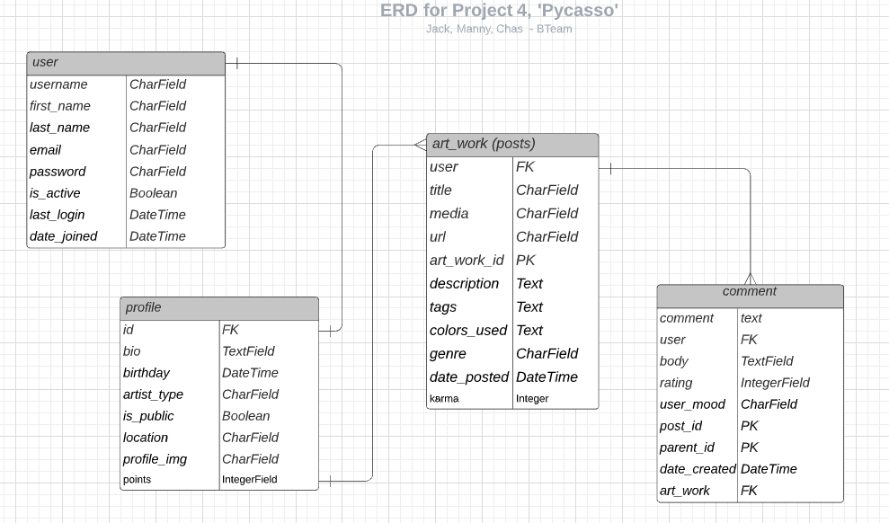
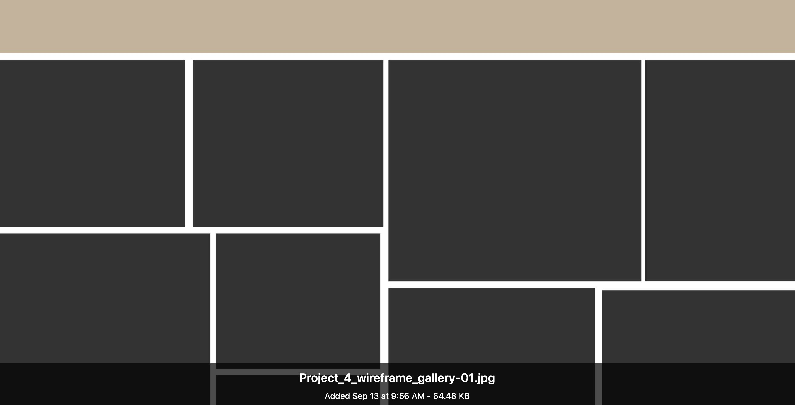

# Pycasso - an Art Media Application built with Django

## Developed by Chas Eubanks, Manuel Fuentes, Jack Lambert

### September 2020

Pycasso is an image and social media type application where users share images of thier different forms of artwork amongst each other. This application was built with Python Django framework.

## Technologies Used

Full CRUD was used wtih Python Django. JavaScript is used for mainly the painting script. For Styling, a framework called [Tachyons.io](https://tachyons.io/) was used, which we felt fit the aesthetic of our design better than bootstrap or materialize.

API from [Harvard](https://github.com/harvardartmuseums/api-docs) was used.

## Getting Started

To get started with this site, simply 'Sign Up' with the Django created form, as being a registered user is required to view Galleries. Navigate through the different links to create your profiles, and see the gallery.

Images from the Gallery are randomly generated from all Users.

The Paint tab brings you to the Paint page which allows you to draw or sketch different png files. Your png files get saved onto the 'files' page where you can view them.

###### (if you click the subtitle 'Make art not war' it changes to quote by a famous artist.)

## Coding Process

Planning: Trello board was used to stay organized on the tasks at hand.

Entity Relationship Diagram: Standard Django Model for User was tied to profile

Design: Layout of varying sizes for painting gallery, designed by Manny

## Unsolved Problems

An attempt was made to use Django-Channels to allow the paint application be shared among users via websockets. However we were unsucessful 'pinging' the canvas data back to a user.

## Future Enhancements

- To make the application more tangible, it would be better to add more user tie-ins, such as searching for other users, friends lists, etc.
- The Paint app has many possibilites such as tying your saved files directly into the Users profile model.
